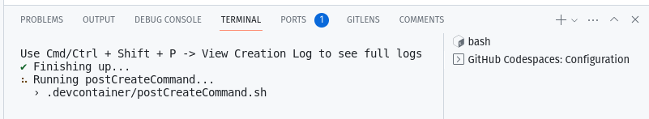

# Umgebung vorbereiten

Das Lab kann vollständig mit GitHub-Codespaces druchgeführt werden. Dafür bauchst du einen GitHub-Account.

**Wir empfehlen die Durchführung des Labs unbedingt mit GitHub Codespaces.** Dies aus folgenden Gründen:
- die Zeit für das Lab ist sehr kurz
- die Labs wurden mit GitHub Codespaces getestet
- Vermeidung von Installationsproblemen auf dem lokalen System (z.B. falsche Python Version, System Libraries fehlen, etc.)

Wer will, kann die Labs aber auch lokal durchführen. Eine detaillierte Installationsanleitung befindet sich in [Lokale Umgebung aufsetzen](002_lab_environment_local.md).

## GitHub-Repository

Es existiert ein Template Repository unter https://github.com/puzzle/mlops-techlab-digits-template. Dieses Repository dient als Startpunkt für dein eigenes Repository und enthält auch Lösungen zu jedem Lab, falls du einmal nicht weiterkommen solltest, kannst du die Dateien vom entsprechenden Branch kopieren. Das Repository ist schreibgeschützt und du musst dein eigenes Repository erstellen.

Dein Repository kannst du wie folgt erstellen:

1. "Use this template" aufklappen und "Create new repository" klicken:   

1. Repository name "digits" wählen und auf "Private" setzen:   

## GitHub-Codespace

Aus deinem neu erstellten Repository kannst du nun GitHub-Codespace öffnen.

1. Kontrolliere ob du dich auf deinem eigenen Repository befindest: https://github.com/<GIT_USER>/digits
1. Unter "Code -> Codespaces" kannst du nun mit "Create codespace on main" die Umgebung starten:   

1. Nach einiger Zeit öffnet sich die VSCode Umgebung.   
**ACHTUNG**: Es ist wichtig zu warten, bis im unteren Bereich die folgende Meldung erscheint und sich diese dann auch von selbst schliesst (die Installation kann eine Weile dauern):

Weitere Informationen zu Codespace: [Creating a codespace for a repository](https://docs.github.com/en/codespaces/developing-in-codespaces/creating-a-codespace-for-a-repository)

---

[← STARTSEITE](../README.md) |
[Prototyp ML-Experiment →](010_lab_initial_prototype.md)
