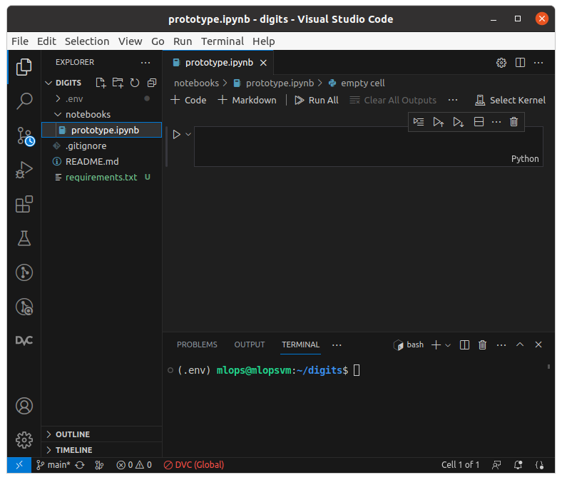
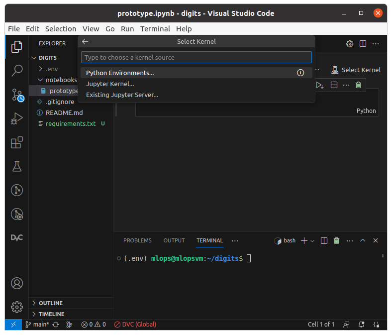
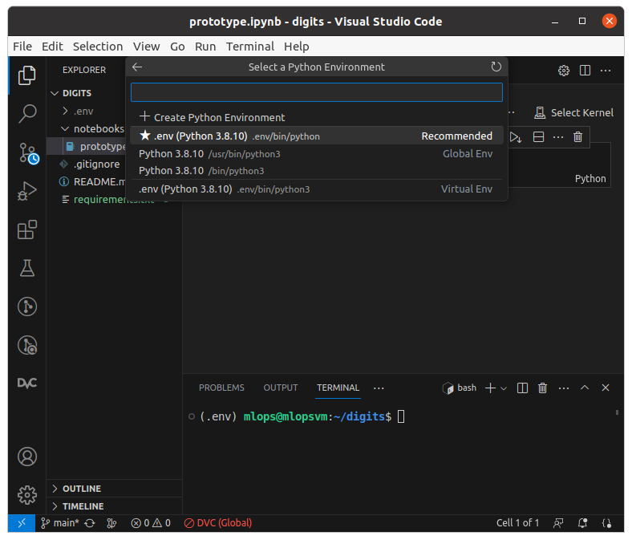
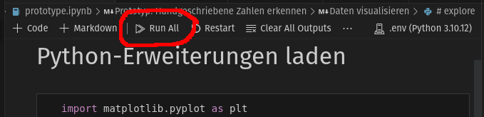
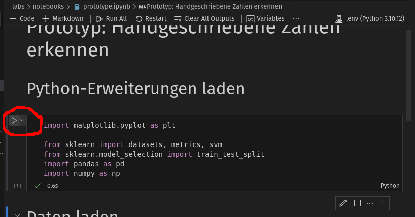

# Prototyp ML-Experiment

Wir haben ein Jupyter-Notebook mit dem Prototypen [notebooks/prototyp.ipynb](notebooks/prototype.ipynb) erstellt.

Damit du den Code im Jupyter-Notebook ausführen kannst, musst du die Python-Umgebung konfigurieren. Danach kannst du entweder mit `Run All` alle Codeabschnitte oder mit dem Pfeil links neben dem Codeabschnitt den einzelnen Abschnitt ausführen.  

1. Die Datei [notebooks/prototyp.ipynb](notebooks/prototype.ipynb) öffnen.
1. Die erstellte Python-Umgebung wie folgt konfigurieren:
    1. Oben rechts _Select Kernel_ wählen.   
        
    1. Im Menü _Python Environments..._ klicken:   
        
    1. Das vorher erstellte Environment `.env` auswählen:
        
1. Codeabschnitte ausführen
    * Alle gemeinsam ausführen:  
        

    * Einzelner Abschnitt ausführen

        Logischerweise müssen die Abschnitte in der gegebenen Reihenfolge ausgeführt werden, da sonst die Abhängigkeiten nicht gegeben sind.
        
        
