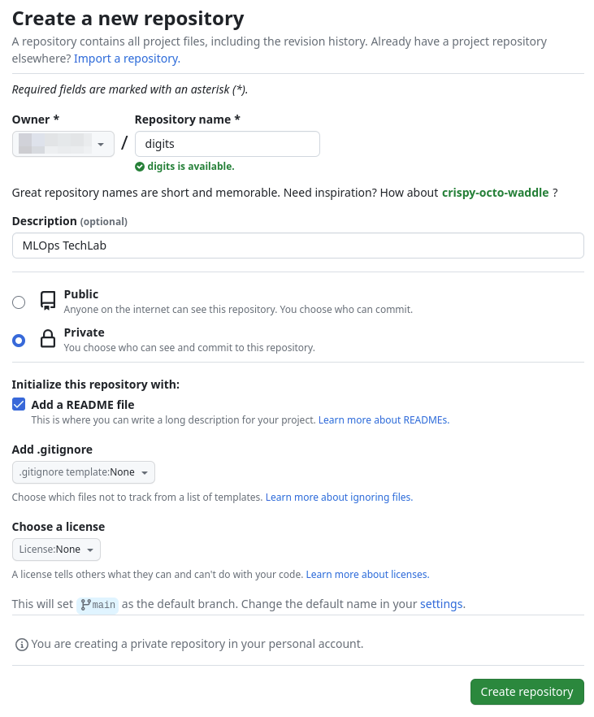
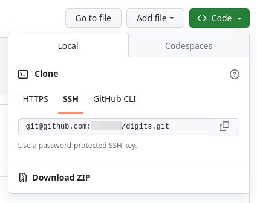

# GitHub Repository erstellen

Um die Labs durchführen zu können, wird ein eigenes GitHub Repository benötigt.

Dieses kann unter dem eigenen Account wie folgt erstellt werden:

1. Aufrufen von https://github.com/GITHUB_USER?tab=repositories
1. Klick auf _New_
1. Optionen wie im Screenshot wählen:   
    
1. Danach _Create repository_ klicken
1. Kopieren der Repository URL:   
    
1. In einem Terminal das Repository klonen:
    ```shell
    git clone git@github.com:GITHUB_USER/digits.git
    ```
1. Ins Verzeichnis wechseln:
    ```shell
    cd digits
    ```
