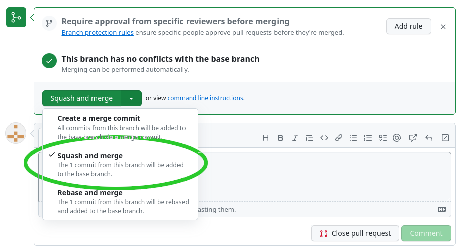

# GitHub Actions

## Konfiguration Repository

Im Repository unter _Settings -> Actions -> General_ müssen unter _Workflow permissions_ die folgenden beiden Optionen ausgewählt werden:

- Read and write permissions
- Allow GitHub Actions to create and approve pull requests

Im den folgenden Screenshots ist zu sehen, welche Optionen gemeint sind:


## Pipeline bei jedem Push ausführen

1. Die Datei `.github/workflows/cml.yaml` mit folgendem Inhalt erstellen:

```yaml
name: CML & DVC
on:
  push:
    paths:
      - "src/**"
      - "params.yaml"
      - "dvc.*"
jobs:
  train-and-report:
    runs-on: ubuntu-latest
    steps:
      - uses: actions/setup-node@v3
        with:
          node-version: 16
      - uses: iterative/setup-cml@v1
      - uses: actions/checkout@v3
      - name: Train model
        run: |
          cat requirements.txt | grep -v -e jupyter > ci_requirements.txt
          pip install -r ci_requirements.txt
          PYTHONPATH=$PWD dvc repro
      - name: Create CML report
        env:
          REPO_TOKEN: ${{ secrets.GITHUB_TOKEN }}
        run: |
          echo "## Metrics" >> report.md

          git fetch --prune
          dvc metrics show --md >> report.md

          echo "### Diff" >> report.md
          dvc metrics diff main --md >> report.md
          echo "#### Params" >> report.md
          dvc params diff main --md >> report.md

          echo "## Plots" >> report.md
          echo "### Class confusions" >> report.md
          echo '' >> report.md

          cml comment create report.md
```

2. Änderungen in Git hinzufügen und pushen:
    ```shell
    git add .
    git commit -m "Add GitHub action execution."
    git push
    ```

## Experiment mit Kernel `poly`

1. Einen neuen Branch erstellen mit:
    ```shell
    git checkout -b exp-kernel-poly
    ```
1. In der Datei `params.yaml` den Parameter `kernel` auf `poly` ändern und die Datei speichern.
1. Pipeline ausühren
    ```shell
    dvc repro
    ```
1. Änderungen pushen mit:
    ```shell
    git add .
    git commit -m "Experiment with kernel poly."
    git push --set-upstream origin exp-kernel-poly
    dvc push
    ```
1. Unter https://github.com/GITHUB_USER/digits/actions wird nun ein Workflow ausgeführt.
1. Ein Link zum Report wird in den Logs angezeigt:   
    
1. Mit einem Klick auf den Link gelangt man auf den Commit. Ganz unten ist ein Kommentar mit dem Report zu sehen.
1. Lokal wechseln wir wieder zurück auf den `main`:
    ```shell
    git checkout main
    git pull
    dvc pull
    ```

## Pull Request

Oben haben wir gesehen, dass ein Commit mit einem Report erstellt wird. Es ist manchmal schwierig, diese Reports zu finden. Schöner wäre, wenn direkt ein Pull Request mit dem Report erstellt wird. Diesen könnte man dann im Team reviewen und wenn z.B. der `f1 score` besser ist, mergen.

Dazu machen wir im `.github/workflows/cml.yaml` folgende Änderungen:

```diff
        run: |
+         cml pr --skip-ci .

          echo "## Metrics" >> report.md

          git fetch --prune
          dvc metrics show --md >> report.md

          echo "### Diff" >> report.md
          dvc metrics diff main --md >> report.md
          echo "#### Params" >> report.md
          dvc params diff main --md >> report.md

          echo "## Plots" >> report.md
          echo "### Class confusions" >> report.md
          echo '' >> report.md

-         cml comment create report.md
+         cml comment create --target=pr --update report.md
```

Nun committen wir die Änderungen auf unser Repository:

```shell
git add .
git commit -m "Create pr"
git push
```

Nun führen wir nochmal ein Experiment durch:

1. Einen neuen Branch erstellen mit:
    ```shell
    git checkout -b exp-kernel-experiments
    ```
1. In der Datei `params.yaml` den Parameter `kernel` auf `sigmoid` ändern und die Datei speichern.
1. Pipeline ausführen
    ```shell
    dvc repro
    ```
1. Änderungen pushen mit:
    ```shell
    git add .
    git commit -m "Experiment with kernel sigmoid."
    git push --set-upstream origin exp-kernel-experiments
    dvc push
    ```
1. Unter https://github.com/GITHUB_USER/digits/actions wird wieder ein Workflow ausgeführt.
1. Ein Link zum Report wieder in den Logs angezeigt. Doch diesmal befindet sich der Report direkt in einem Pull-Request. Mit einem Klick auf den Link gelangt man auf den Pull-Request mit dem Report.
1. Wir sehen, dass der `f1 score` im Vergleich zum `main` sehr viel schlechter ist. Das Team würde dieses Modell sicherlich nicht integrieren wollen.

Darum erstellen wir ein weiteres Experiment:

1. In der Datei `params.yaml` den Parameter `kernel` auf `linear` ändern und die Datei speichern.
1. Pipeline ausführen:
    ```shell
    dvc repro
    ``` 
1. Änderungen pushen mit:
    ```shell
    git add .
    git commit -m "Experiment with kernel linear."
    git push
    dvc push
    ```
1. Wieder wird ein Worklfow unter https://github.com/GITHUB_USER/digits/actions ausgeführt.
1. Mit dem Link in den Logs gelangt man wieder zum Pull Request wenn der Workflow ausgeführt wurde.
1. Auch wenn der `f1 score` nicht besser ist, mergen wir diesen Branch zurück auf `exp-kernel-experiments`. **ACHTUNG**: Es ist wichtig, dass **Squash and merge** oder "Rebase and merge" gewählt wird! So wird verhindert, dass erneut ein Build ausgeführt und ein neuer Pull Request erstellt wird. Im folgenden Screenshot ist zu sehen, was gewählt werden muss:   


1. Wir könnten nun weitere Experimente starten lassen und wenn wir ein gutes Modell gefunden haben, könnte der Branch `exp-kernel-experiments` in den `main` reintegriert werden (auch hier wieder **Squash and merge** benutzen!). Wer will, kann dies tun und einen Pull Request für `exp-kernel-experiments` auf `main` erstellen und mergen.
1. Lokal wechseln wir wieder zurück auf den `main`:
    ```shell
    git checkout main
    git pull
    dvc pull
    ```

---

[← Metriken und Experimente](040_lab_metrics.md) | [STARTSEITE](../README.md) |
[Modell manuell testen →](060_lab_deploy_model.md)
