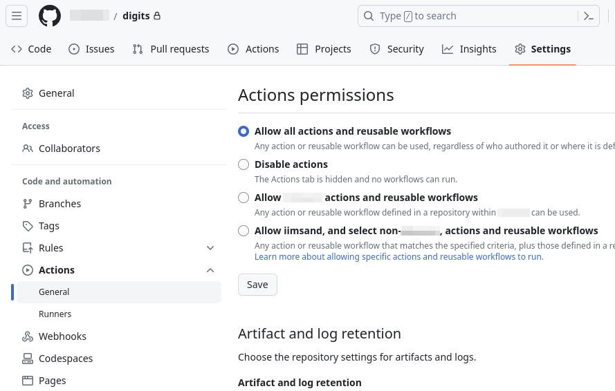
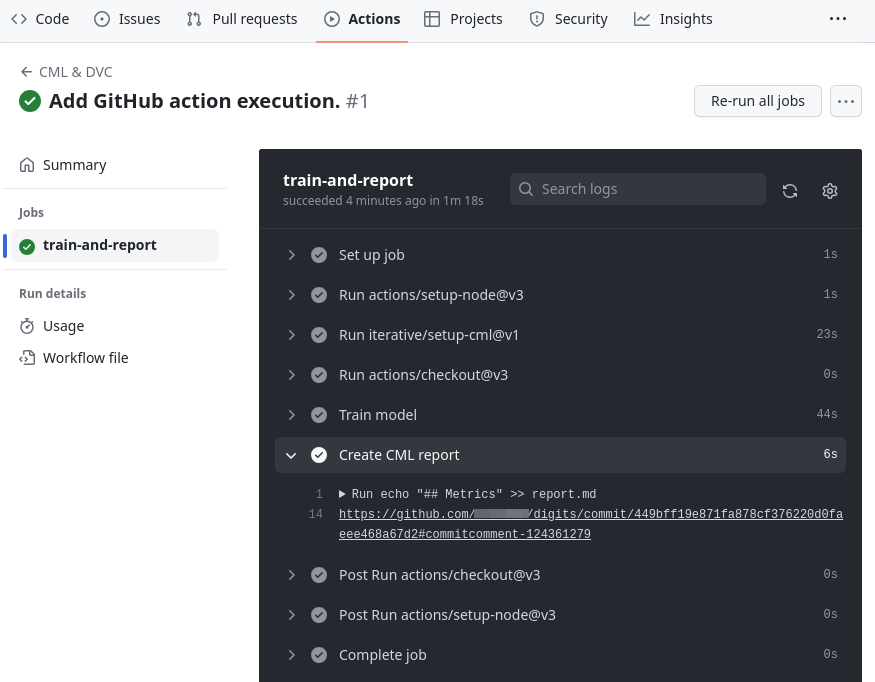

# GitHub Actions

## Konfiguration Repository

Im Repository unter _Settings -> Actions -> General_ müssen unter _Workflow permissions_ die folgenden beiden Optionen ausgewählt werden:

- Read and write permissions
- Allow GitHub Actions to create and approve pull requests

Im den folgenden Screenshots ist zu sehen, welche Optionen gemeint sind:




## Pipeline bei jedem Push ausführen

1. Die Datei `.github/workflows/cml.yaml` mit folgendem Inhalt erstellen:
    ```yaml
    name: CML & DVC
    on: [push]
    jobs:
      train-and-report:
        runs-on: ubuntu-latest
        steps:
          - uses: actions/setup-node@v3
            with:
              node-version: 16
          - uses: iterative/setup-cml@v1
          - uses: actions/checkout@v3
          - name: Train model
            run: |
              cat requirements.txt | grep -v -e jupyter > ci_requirements.txt
              pip install -r ci_requirements.txt
              PYTHONPATH=$PWD dvc repro
          - name: Create CML report
            env:
              REPO_TOKEN: ${{ secrets.GITHUB_TOKEN }}
            run: |
              echo "## Metrics" >> report.md
    
              git fetch --prune
              dvc metrics show --md >> report.md
    
              echo "### Diff" >> report.md
              dvc metrics diff main --md >> report.md
    
              echo "## Plots" >> report.md
              echo "### Class confusions" >> report.md
              echo '' >> report.md          
    
              cml comment create report.md
    ```
1. Änderungen in Git hinzufügen und pushen:
    ```shell
    git add .
    git commit -m "Add GitHub action execution."
    git push
    ```
1. Unter https://github.com/GITHUB_USER/digits/actions wird nun ein Workflow ausgeführt.
1. Ein Link zum Report wird in den Logs angezeigt:   
    
1. Mit einem Klick auf den Link gelangt man auf den Commit. Ganz unten ist ein Kommentar mit dem Report zu sehen.

## Experiment mit Kernel `poly`

1. Einen neuen Branch erstellen mit:
    ```shell
    git checkout -b exp-kernel-poly
    ```
1. In der Datei `params.yaml` den Parameter `kernel` auf `poly` ändern und die Datei speichern.
1. Pipeline ausführen mit:
    ```shell
    dvc repro
    ```
1. Änderungen pushen mit:
    ```shell
    git add .
    git commit -m "Experiment with kernel poly."
    git push --set-upstream origin exp-kernel-poly
    dvc push
    ```
1. Unter https://github.com/GITHUB_USER/digits/actions wird wieder ein Workflow ausgeführt.
1. Ein Link zum Report wieder in den Logs angezeigt. Mit einem Klick auf den Link gelangt man auf den Commit. Ganz unten ist ein Kommentar mit dem Report für diesen Branch zu sehen. Es ist ersichtlich, dass der `f1 score` tiefer als derjenige auf dem `main` Branch ist.
1. Wieder auf den `main` zurückwechseln:
    ```shell
    git checkout main
    dvc pull
    ```

## Experiment mit Kernel `sigmoid`

1. Einen neuen Branch erstellen mit:
    ```shell
    git checkout -b exp-kernel-sigmoid
    ```
1. Experiment ausführen mit:
    ```shell
    dvc exp run -n kernel-sigmoid \
        --set-param train.svc_params.kernel=sigmoid
    ```
1. Änderungen pushen mit:
    ```shell
    git add .
    git commit -m "Experiment with kernel sigmoid."
    git push --set-upstream origin exp-kernel-sigmoid
    dvc push
    ```
1. Unter https://github.com/GITHUB_USER/digits/actions wird wieder ein Workflow ausgeführt.
1. Ein Link zum Report wieder in den Logs angezeigt. Mit einem Klick auf den Link gelangt man auf den Commit. Ganz unten ist ein Kommentar mit dem Report für diesen Branch zu sehen. Es ist ersichtlich, dass der `f1 score` tiefer als derjenige auf dem `main` Branch ist.
1. Wieder auf den `main` zurückwechseln:
    ```shell
    git checkout main
    dvc pull
    ```
